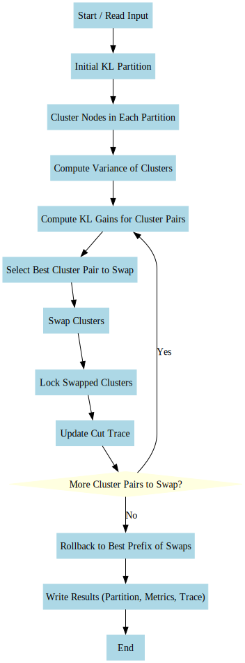

# Kernighan-Lin VLSI

The implementation of Kernighan-Lin VLSI Algorithm

## Notice

Enhancements

- using Clusters
+ using Variance for calculating vectors weights

### Q&A

A demo of the algorithm can be find in  <a href="demo">Demo</a> 

Docs can be found at <a href="https://nimaposhtiban.github.io/Kernighan-Lin/">docs</a> 

The Project uses [Qt](https://www.qt.io),

